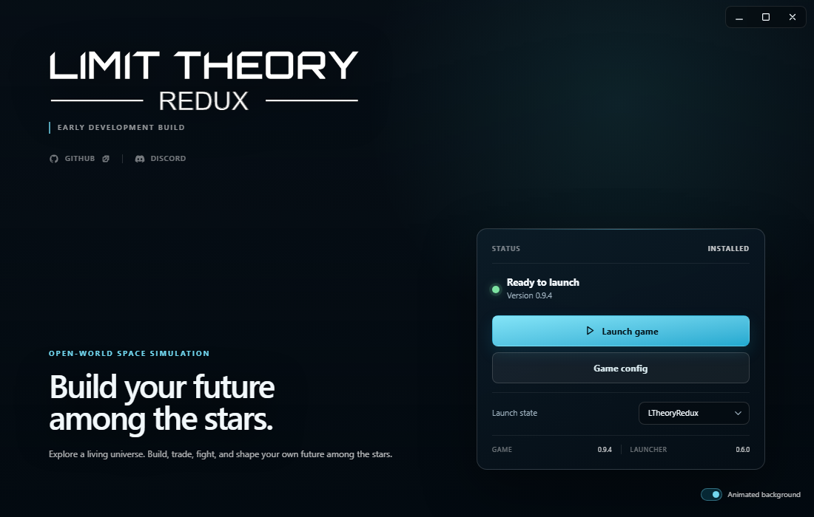
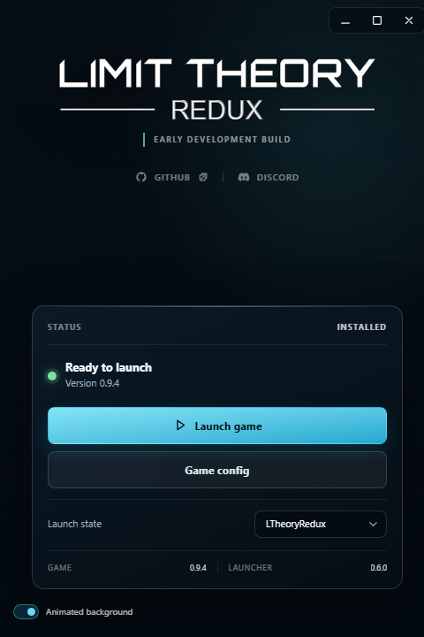
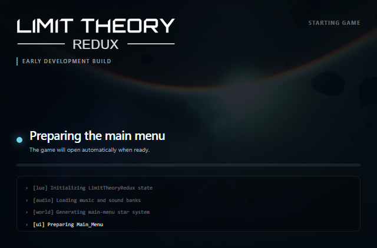

# Limit Theory Redux Launcher

A Windows launcher for Limit Theory Redux built with Tauri 2, Rust, Nuxt 4, and Vue 3. The interface uses a small set of repository-native Vue components instead of a general-purpose UI framework.

> Limit Theory Redux is in early development. Expect incomplete features and breaking changes.

> **Upgrading from launcher 5.0.1?** Install 0.6.0 manually once from the
> [latest release](https://github.com/Limit-Theory-Redux/ltheory-launcher/releases/latest).
> Automatic updates resume after that reinstall.

## Security

- [Security policy](./SECURITY.md)

## Screenshots

### Wide layout

<p align="center">
  
</p>

### Compact layout

<p align="center">
  
</p>

### Game startup

<p align="center">
  
</p>

## Development

## Prerequisites

- [Rust](https://www.rust-lang.org/)
- [Tauri](https://tauri.app/)
- [bun](https://bun.com/)

## Developing the app

```powershell
bun install
bunx tauri dev
```

## Building the app

```powershell
bunx tauri build
```

## Verification

```powershell
bun run typecheck
bun run generate
bun audit
cd src-tauri
cargo check
cargo audit --no-fetch
```
